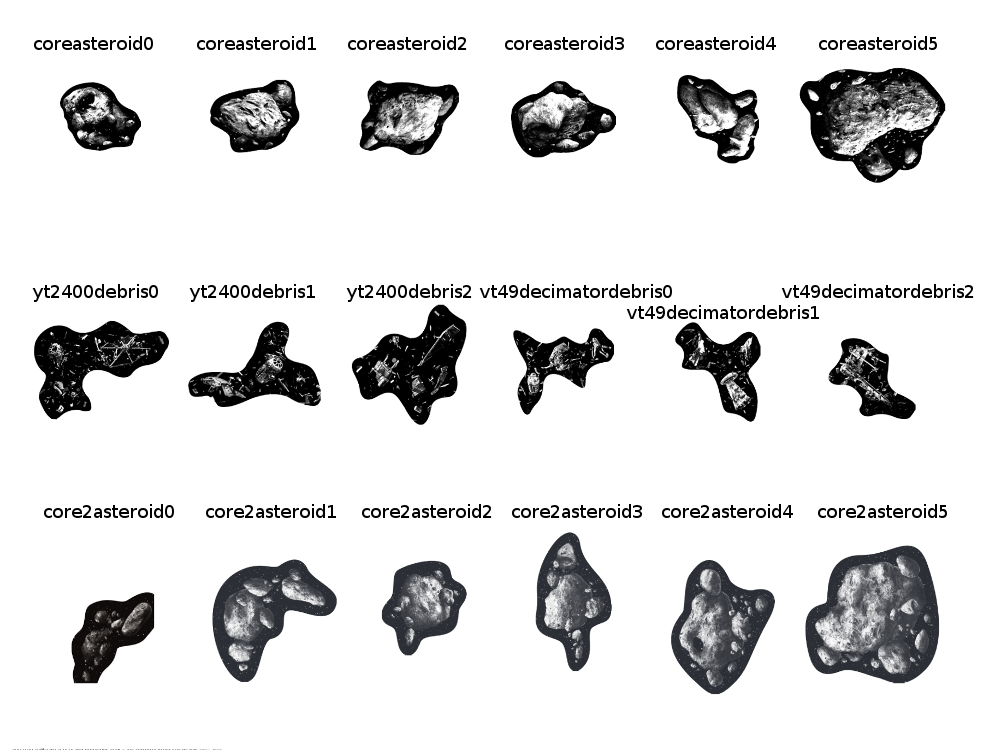

# X-Wing Squadron Specification version 1.0.0

This specification facilitates the export and subsequent import of squadrons for
FFG's X-Wing Miniatures game from one compliant application to another.

## Goals
* Allow users to easily move a squadron from one squadron building app to another
* Allow users to share a squadron without dictating how it should be viewed
* Backup multiple squadrons without being tied to a specific app to restore them
* Be future-proof
* Be human-readable
* Be human-writeable (with just a text editor)


## Multiple Squadron Data Format (X-Wing Squadron Container Format or .XWC)
A container can be represented as a stand-alone JSON file encoded in UTF-8 with
either an .xwc or a .json extension. MIME types of application/json or
text/plain SHOULD be accepted by API endpoints.

Using this format, multiple squadrons can be stored together, as an array
wrapped in a dictionary with a single mandatory key.

This can represent such things as the entirety of a player's squadrons saved in
a squad builder application, the set of lists used by a player during an
escalation league, the top 8 tables from a tournament, etc.

Requirement | Key | Type | Notes
---|---|---|---
Mandatory | container | Array | List of squadron objects; see below.
 | | |
Ignored | vendor | Dictionary | An object used to store vendor-specific data; see above.

In situations where the type of data being imported is not known, a container
data structure can be identified by the mandatory `container` key.


## Single Squadron Data Format (X-Wing Squadron Format or .XWS)
A container can be represented as a stand-alone JSON file encoded in UTF-8 with
either an .xws or a .json extension. MIME types of application/json or
text/plain SHOULD be accepted by API endpoints.

A squadron is generally a single player's list used for an X-Wing Miniatures
match.

Note that no assertion of tournament-legality is made for a squadron represented
in this format. While the specification targets tournament legal lists
(single-faction, points and pilots as printed, etc.), there are some rules of
list construction that are not enforced by this specification (point totals,
pilots having the required upgrade slots for an upgrade card, etc.).

Importing implementations MUST perform validation before making assumptions
about the appropriate nature of a list for any given purpose.


### Squadron Attributes
Requirement | Key | Type | Notes
---|---|---|---
Mandatory | faction | String | Canonicalized faction name. Possible values: "rebel", "imperial", "scum".
Mandatory | pilots | Array | List of one or more pilots; see below.
 | | |
Optional | name | String | Human-readable squadron name.
Optional | description | String | Text description or notes for the squadron.
Optional | obstacles | Array | Array of three Strings, each being an identifier for the obstacle chosen for tournament use.
Optional | damagedeck | String | Canonical name of the package of the damage deck chosen for tournament use (one of `core` or `core2`).
 | | |
Ignored | points | Integer | Total point cost of the squadron. MUST be ignored by importing applications; for human readability only.
Ignored | vendor | Dictionary | An object used to store vendor-specific data; see above.

In situations where the type of data being imported is not known, a squadron
data structure can be identified by the mandatory `faction` and `pilots` keys.


## Pilot Data Format
Each entry in the `squadron.pilots` list represents a separate pilot card in the
squadron. Duplicates are repeated verbatim.

A squadron MUST have at least one pilot entry.


### Pilot Attributes
Requirement | Key | Type | Notes
---|---|---|---
Mandatory | name | String | Canonicalized pilot name.
Mandatory | ship | String | Canonicalized ship name.
 | | |
Optional | upgrades | Dictionary | Equipped upgrade cards for this pilot; see below.
Optional | multisection_id | Integer | Indicates membership in a multi-section huge ship; see below.
 | | |
Ignored | points | Integer | Total point cost of the pilot plus upgrades. MUST be ignored by importing applications; for human readability only.
Ignored | vendor | Dictionary | An object used to store vendor-specific data; see above.


### Multi-Section Huge Ships
This spec represents huge ships with multiple pilot cards as multiple entries in
the squad.pilots array. This most closely matches the pilot cards present in the
squadron, even though there is some friction translating that into ships on the
table.

Each pilot card for a multi-section huge ship SHOULD be contiguous in the
squadron.pilots array. Relative ordering of the sections SHOULD NOT be
considered by the importing implementation.

Each multi-section huge ship MUST be assigned a zero-indexed identification
number, and that number must be present in the squadron.pilots entry for that
ship. This allows lists with multiple multi-section huge ships to disambiguate
which section belongs with which other sections.

Note that current tournament rules do not allow for more than one multi-section
huge ship per list (due to the CR90 Corvette costing 3 epic points, and no
format granting more than 5 epic points per list).

```json
[
    {
        ...
    },
    {
        "name": "cr90corvettefore",
        "ship": "cr90corvette",
        "multisection_id": 0,
        "upgrades": {...}
    },
    {
        "name": "cr90corvetteaft",
        "ship": "cr90corvette",
        "multisection_id": 0,
        "upgrades": {...}
    },
    {
        ...
    }
]
```


## Upgrades Data Format
Each entry in the `pilot.upgrades` dictionary MUST have a key of a canonicalized
name of an upgrade slot. The value is an Array of Strings, each the
canonicalized name of an upgrade card for the appropriate slot type.

```json
{
    "name": "...",
    "ship": "...",
    "upgrades": {
        "amd": ["r2d2"],
        "mod": ["hullupgrade"]
    }
}
```


## Canonical Unique IDs
As new ships, pilots, upgrades and other cards are added, it would be best if
their IDs could be generated without further discussion between developers. The
best solution is to canonicalize the card names, taking into account some cards
share the same name (eg. Chewbacca as pilot and as crew, R2-D2 as astromech and
as crew, etc.)


### Canonicalization Rules
1. Take the English-language name as printed on the card
2. Check for special case exceptions to these rules (see below)
3. Lowercase the name
4. Convert non-ASCII characters to closest ASCII equivalent (to remove umlauts, etc.)
5. Remove non-alphanumeric characters
6. Check for collisions, add expansion suffix if needed

#### Canonicalization and Special Cases
A small number of names are abbreviated during canonicalization to reduce data
length. Those special cases can be found at the top of the README_NAMES.md file.

[http://github.com/elistevens/xws-spec/blob/gh-pages/README_NAMES.md](./README_NAMES.md)

Implementation authors should not rely on the rest of the canonicalization
listing to be updated promptly upon the release of new content. It is intended
to be a useful check of an implementation's canonicalization routines, not an
authoritative source for what content is legal.

This information is also provided as part of the `xws-spec` bower package. See
the `window.xws.pilot_faction2ship2pilot2obj_dict` and
`window.xws.upgrade_slot2key2obj_dict` variables.

#### Canonicalization and Name Collisions
To determine collision for upgrades, simply see if there are two cards that have the
same canonicalized name.

To determine collision for pilots, see if there are pilots that for the combination
of (faction, ship, pilot name) have the same canonicalized names. Note that this doesn't use
subfaction, since right now we only specify faction at the list level, not the pilot
level (since you can mix subfactions in a single list).

Pilots and upgrades cannot collide with each other.

When there is a collision, then the canonicalized name becomes:

    ${name}-${expansion product code}${a, b, c, etc. if needed}
    milleniumfalcon-swx57 (HotR Title)
    poedameron-swx57 (PS9)

AS of HotR, the only pilots who need suffixes are Poe, Han and Chewie.

R2-D2 deserves special note, since it's an upgrade card with the same name in two
different slots. Those still collide, and since the droid was released first, the
canonicalization is:

    r2d2 (Astromech Droid)
    r2d2-swx22 (Crew)

This is a retroactive change from earlier versions of the spec (prior to 0.3.0), which
had both versions of R2-D2 canonicalize to ``"r2d2"`. Implementation authors are encouraged
to automatically correct the older `"crew": ["r2d2"]` data to the new canonicalization.

Note also that all pilot versions of Sabine Wren released as of HotR do not require suffixes,
since they are all piloting unique ship names (and the crew, obviously, doesn't conflict
with those either).

If two pilots have the same name in the same pack and are flying the same ship, then we
tack on ``"a"`, `,`"b"` etc. with the ordering determined first by increasing point cost, second
by alphabetical card text if the point costs and ships are the same.

    anakin-swx999a (Speeder Bike Pilot - Light Side (please no))
    anakin-swx999b (Speeder Bike Pilot - Dark Side (no, just no))

When a card appears in multiple expansion packs, we use the lowest numbered expansion,
unless FFG releases packs so far out of order that we've already picked a canonicalization
for a card before a lower swxNN shows up (seems pretty unlikely, but if it happens then
the change will not be made retroactively).

## Obstacles

Obstacle canonicalization is:

    ${set containing the obstacle}${astreiod or debris}${number}

Obstacle outlines are roughly ordered from smallest to largest in the order they're
listed on the official tournament sheet, but since that's somewhat
subjective, the exact numbering of each obstacle should be considered arbitrary.




# Requirements for Application Developers

## Import / Export
Apps that provide the ability to import squadrons in these formats SHOULD
provide the ability to export them.


### Importing Examples
* A form containing a textarea where users can paste the JSON and the app will parse it and load that squadron.
* A file uploader that will accept .json, .XWS and .XWC files
* An API endpoint which would receive a squadron in this format, parse and display it.


### Exporting Examples
* A button to download a text file containing one or multiple squadrons
* A button for exporting a squadron directly to a different app. So, you'd click "export to Voidstate", for example, which would:
  * generate the JSON version of the squadron,
  * POST it to an API endpoint (eg. http://xwing-builder.co.uk/import),
  * where the app would parse the JSON and
  * reload the page with the squadron builder populated with that squadron


### Import Failures
When encountering a canonicalized name that is not recognized, an implementation
MAY reject the input with an error, silently drop the unrecognized portions of
the input, preserve the unrecognized data, or behave in some other manner
consistent with the purpose of the application. It is recommended that apps
ignore unrecognised data where possible.

Implementations SHOULD provide an indication that the data might have changed on
import, when feasible.

Note: Some builders may include unreleased cards, where the canonical name is
not known. Their export would be valid if re-imported into the original app but
MAY fail when imported into other applications.


### Checking should also be implemented by the app importing a squadron,
including ensuring that:
* Point totals are correct
* There are no illegal upgrades
* Factions are not mixed


## Vendor-Specific Extensions
To accomodate vendor-specific metadata, every Dictionary can optionally include
the `"vendor"` key. To prevent collisions between different implementations'
metadata, any data placed into the `"vendor"` key MUST be structured as follows:

```json
{
    "vendor": {
        "IMPLEMENTATION_NAME": {
            ...,
        }
    }
}
```

Where IMPLEMENTATION_NAME is a unique identifier for the application. An
application is free to structure the internal dictionary as desired, however the
following keys SHOULD be used consistently if provided at the top level of the
application-specific dictionary:

Requirement  | Key |  Type  | Notes
---|---|---|---
Optional | url | String | URL to this item in the exporting application.
Optional | builder | String | Name of the exporting squad-building application.
Optional | builder_url | String | URL to the exporting squad-building application.
 | | |
Ignored | ??? | Any | Other properties can be added as desired by the implementation.

After importing a squadron or collection, the application SHOULD remove all
unrecognized vendor properties before exporting again. This is to prevent
obsolete data being exported. It is acceptable to entirely remove all other
implementations' vendor keys to accomplish this.


# Sample XWS Data Structure
This sample shows a build with lots of upgrades, some added dynamically by other
upgrades (A-Wing Test Pilot). It includes all required and optional data as well
as vendor data at both top level and squadron level.

[http://github.com/elistevens/xws-spec/blob/gh-pages/sample.json](./sample.json)


# Validation
Implementations MAY use the following JSON schema to validate XWS data.

[http://github.com/elistevens/xws-spec/blob/gh-pages/schema.json](./schema.json)

More on JSON schemas can be fond at:

- http://json-schema.org
- https://github.com/geraintluff/tv4

Additionally, the `xws-spec` bower package has custom validation functions that
can be used to validate single-squadron lists. An online validator can be found
at:

http://elistevens.github.io/xws-spec/


# Versioning
This spec SHALL have a version number.

Future versions of this specification will increment the version number
according to http://semver.org/ . Due to this spec being tied to validation
functions, this specification will get a patch-level revision when new content
is available.

The version number SHOULD NOT be used to reject squadrons on import. An
exporting implementation might support content through wave 6 but a given
squadron could be valid for wave 4. An importing application that has content
through wave 5 should not reject the squadron based on the spec version
indicated in the export JSON.

The version number SHALL be incremented when FFG releases errata that changes
the point cost of any pilots or cards.

Updating the version should include change the number in the README.md,
src/xws_validate.coffee, bower.json, and package.json files.


# QR Code Support (Experimental)
Implementations are encouraged to provide QR codes containing single-squadron
XWS JSON when it makes sense to do so, and similarly to provide QR code scanning
when appropriate.

The primary envisioned use case is for builders to provide a QR code that can be
loaded on a mobile device and scanned in by tournament organizing software to
quickly provide name and list information to the tournament organizer.

The content of the QR code should be in one of two forms:

- The raw XWS JSON with all optional whitespace removed from the JSON.
- The above compressed with a zlib-compatible compression algorithm.

In addition, implmenetations are encouraged to:

- Provide a sizable white border around the QR code.
- Allow mobile devices to zoom/scale the QR code

Based on limited experimental evidence, implementations are encouraged to use
error correction level H (high; 30%). Further experimentation may refine this
suggestion.

http://en.wikipedia.org/wiki/QR_code#Error_correction

Implementation authors are encouraged to share their experiences with QR codes,
as there are a large number of possible environments and scanners, and this spec
aims to provide guidelines for use in as many of those as possible.

# Implementations and Resources
A listing of known applications and developer resources that might be of use when working with XWS. Please submit pull requests with additions!

## Applications that implement import and/or export
- http://lists.starwarsclubhouse.com/ https://github.com/lhayhurst/xwlists
    X-Wing List Juggler. A web site to track X-Wing Miniature Combat lists and tournament stats.
- https://geordanr.github.io/xwing/ https://github.com/geordanr/xwing
    (Yet Another) X-Wing Miniatures Squad Builder
- http://xwing-builder.co.uk/ 
    Unofficial X-Wing Squadron Builder
- http://x-wing.fabpsb.net/
    Fab's squadrons generator
- http://randolphw.github.io/han-shopped-first/
    Han Shopped First. Makes purchase suggestions for starting collections or building out factions, or getting a specific list.
- https://github.com/kingargyle/xstreamer
    X-Wing Squad Helper for Twitch and YouTube Streamers.

## Resources for developers
- https://github.com/guidokessels/xwing-data. 
    An easy-to-use collection of data and images from X-Wing: The Miniatures Game by Fantasy Flight Games. 
    It has every card in the game, and each pilot and upgrade has the XWS id so you should be able to follow the XWS spec.
- https://github.com/voidstate/xwing-card-images 
    A collection of card images from X-Wing: The Miniatures Game by Fantasy Flight Games, arranged and named to be compatible with the XWS format.
    Initially forked from guidokessels/xwing-data
- https://github.com/geordanr/xwing-miniatures-font
    X-Wing Miniatures Font. Vector font by Hinny and armoredgear7.

